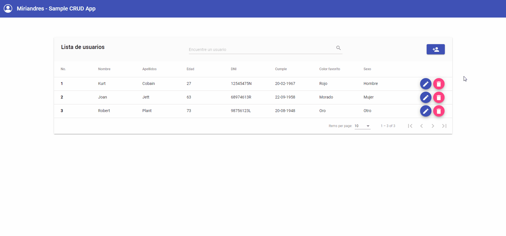

# MEAN Stack CRUD Application
Proyecto final del Curso de Desarrollo Full-Stack de Samsung DesArrolladoras, impartido por Bejob y con certificación académica de la Fundación General de la Universidad de Alcalá (FGUA).

## Requisitos del proyecto
Se creará una interfaz con Angular para realizar peticiones y una API desarrollada con Express para listar, crear, editar y eliminar contactos. Deberá usarse Angular Material para la maquetación. A la hora de crear o editar una persona será necesario realizar las siguientes validaciones sobre los parámetros:

* `Nombre:` no puede incluir números y la longitud debe ser superior a 3.
* `Apellidos:` no puede incluir números y la longitud debe ser superior a 3.
* `Edad:` número comprendido entre 0 y 125.
* `DNI:` cadena alfanumérica de 9 caracteres.
* `Cumpleaños:` fecha en formato ISO8601.
* `ColorFavorito:` no puede incluir números y la longitud debe ser superior a 3.
* `Sexo:` cadena de texto comprendida en la siguiente lista: Hombre, Mujer, Otro, No especificado.
* El funcionamiento de la API se puede comprobar con la aplicación `Postman`, al igual que se describió en la nota técnica.

## Autor ✒️
**Miriam Andrés** - *Documentación y Código*
* [Website](https://miriamandres.com)
* [Github](https://github.com/miriandres)
* [LinkedIn](www.linkedin.com/in/miriandres)

## Construido con 🛠️
[](https://angular.io/)
[](https://material.angular.io/)
[](https://www.w3schools.com/html/)
[](https://www.typescriptlang.org/)
[](https://www.typescriptlang.org/)
[](https://www.mongodb.com/)
[](https://expressjs.com/)
[](https://nodejs.org/en/)
[](https://www.postman.com/)
[](http://getbem.com/)

## Instalación
### Requisitos previos
* Descargar e instalar [NodeJS](https://nodejs.org/en/download/)
* Descargar e instalar [MongoDB](https://www.mongodb.com/)

### Clonar repositorio
```
$ git clone https://github.com/miriandres/MEAN-Stack-CRUD-Application.git
$ cd MEAN-Stack-CRUD-Application 
```
### Ejecutar la aplicación en Angular
```
$ cd frontend
$ npm install
$ ng serve
```

### Iniciar el servidor
```
$ cd server
$ npm install
$ npm run dev 
```

## Probando la aplicación en Postman

|        RUTA          |       HTTP        |      Descripción           | 
|--------------------- | ----------------- | -------------------------- | 
|/api/users            |       GET         | Mostrar lista de usuarios  | 
|/api/user             |       POST        | Crear nuevo usuario        | 
|/api/user/:id         |       GET         | Seleccionar usuario por id | 
|/api/user/:id         |       PUT         | Actualizar usuario por id  |    
|/api/user/:id         |       DELETE      | Eliminar usuario por id    |

## Mejoras
- [x] Añadir sistema de filter, sort y pagination
- [x] Actualizar a versión Angular 13

## Contratación
Si quieres contratarme puedes escribirme a hello@miriamandres.com para consultas.

## Licencia 📄
MIT Public License v3.0
No puede usarse comercialmente.